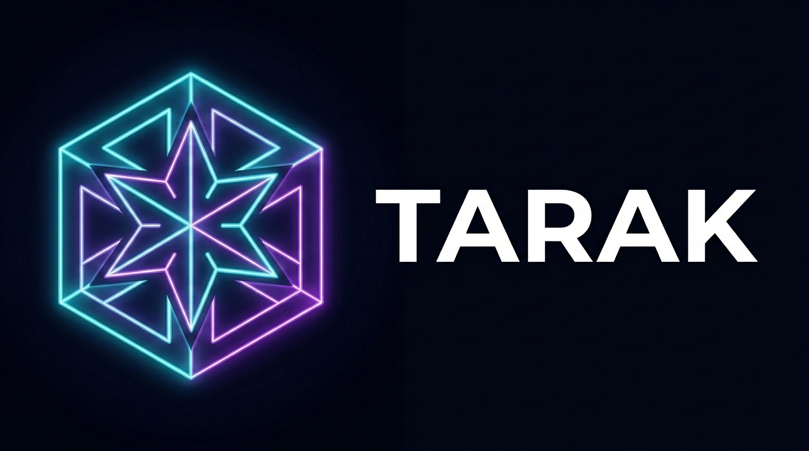

<p align="center">
  
</p>

# Tarak

**Tarak** is a lightning-fast, lightweight, and native container orchestration platform that works everywhere—without requiring Docker Desktop, WSL, or heavy VMs. Compatible with Kubernetes APIs, but reimagined for pure speed, minimal memory usage, and zero external dependencies.

[](https://go.dev/)
[](https://vikukumar.github.io/tarak/)
[](https://vikukumar.github.io/tarak/)
[](https://github.com/vikukumar/tarak/releases)
[](https://vikukumar.github.io/tarak/)
[](https://pkg.go.dev/github.com/vikukumar/tarak/pkg/client)
[](LICENSE)

---

## ⚡ Quick Installation

### Linux & macOS (One-Line Install)
```bash
curl -fsSL https://raw.githubusercontent.com/vikukumar/tarak/main/install.sh | bash
```

### Windows (PowerShell One-Line Install)
```powershell
irm https://raw.githubusercontent.com/vikukumar/tarak/main/install.ps1 | iex
```

### Go SDK Package (for developers)
```bash
go get -u github.com/vikukumar/tarak/pkg/client@latest
```

---

## 🚀 Why Tarak vs Kubernetes & K3s?

| Feature / Metric | ⚡ Tarak | ⛵ K3s | ☸️ Standard Kubernetes (K8s) |
|---|---|---|---|
| **Idle RAM Footprint** | **< 25 MB** | ~500 MB | ~1.2 GB+ |
| **Cold Start Time** | **< 180 ms** | 10 – 20 sec | 45 – 90 sec |
| **Windows Native Isolation** | **Native (Zero WSL / No Hyper-V)** | Requires WSL2 | Requires Docker/WSL2 |
| **External Dependencies** | **0 (Pure Go Standalone)** | containerd, runc | containerd/CRI-O, etcd, CNI |
| **Kubernetes API Compatibility** | **100% Core K8s API Compliant** | 100% Compliant | Standard |
| **Cross-Platform Support** | Windows / Linux / macOS (ARM64 & AMD64) | Linux only (WSL on Win) | Linux only (WSL on Win) |

---

## 📦 Included Binaries in Release

Each release includes ready-to-run binaries for all platforms and architectures:

* ⚡ **`tarak`**: The **All-in-One** unified runtime (Server + Agent + Init + CLI in one single executable).
* 🖥️ **`tarakd`**: The dedicated standalone API server & control-plane daemon.
* 🤖 **`taraks`**: The dedicated lightweight worker node runtime agent.
* 🎮 **`tarakctl`** (alias **`taraktl`**): The high-performance Kubernetes-compatible CLI control tool.

---

## 🛠️ Quick Start

### 1. Start the Server
Start the Tarak API Server and native node runtime locally:
```bash
tarak server
```

### 2. Deploy an App
Using `tarakctl`, deploy a sample workload. It automatically extracts and runs real OCI containers:
```bash
tarakctl apply -f app-sample.yml
tarakctl get pods -n demo -o wide
```

### 3. Access your Workload
```bash
tarakctl port-forward pod/web-app-pod 8080:80 -n demo
```
Visit `http://localhost:8080` in your browser!

---

## 🔌 Reusable Go Client SDK Example

You can embed Tarak orchestration directly into your Go applications using `pkg/client`:

```go
package main

import (
    "context"
    "fmt"
    "log"

    "github.com/vikukumar/tarak/pkg/client"
)

func main() {
    c, err := client.NewClientFromKubeconfig("")
    if err != nil {
        log.Fatal(err)
    }

    pods, err := c.Pods("default").List(context.Background())
    if err != nil {
        log.Fatal(err)
    }

    for _, p := range pods {
        fmt.Printf("Pod: %s (Phase: %s, IP: %s)\n", p.Name, p.Phase, p.IP)
    }
}
```

---

## 📖 Full Documentation & GitHub Pages

Visit the live interactive documentation portal:
👉 **[https://vikukumar.github.io/tarak/](https://vikukumar.github.io/tarak/)**

* 📚 [Getting Started Guide](https://vikukumar.github.io/tarak/getting-started.html)
* 🏛️ [System Architecture](https://vikukumar.github.io/tarak/architecture.html)
* 💻 [CLI Reference](https://vikukumar.github.io/tarak/cli-reference.html)
* 📦 [Releases & Changelog Explorer](https://vikukumar.github.io/tarak/releases.html)

---

## 🤝 Contributing
Contributions make the open source community such an amazing place to learn, inspire, and create. Please read our [CONTRIBUTING.md](CONTRIBUTING.md) and [CODE_OF_CONDUCT.md](CODE_OF_CONDUCT.md).

## 🛡️ Security
If you discover a security vulnerability within Tarak, please refer to [SECURITY.md](SECURITY.md).

## 📄 License
Distributed under the MIT License. See [LICENSE](LICENSE) for more information.
