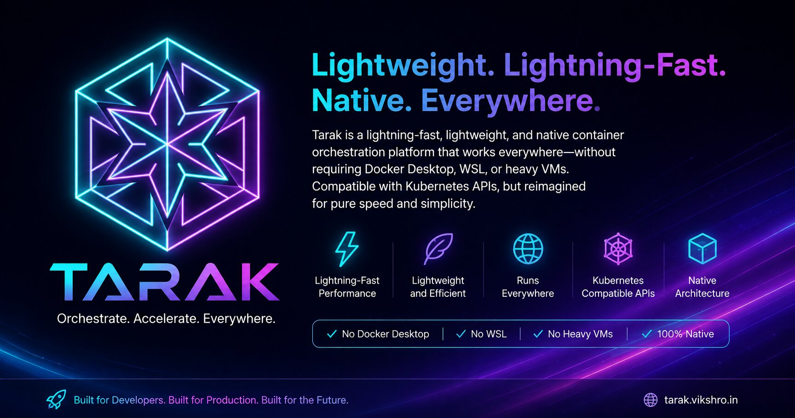

<p align="center">
  
</p>

# Tarak

**Tarak** is a lightning-fast, lightweight, and native container orchestration platform that works everywhere — without requiring Docker Desktop, WSL, or heavy VMs. Fully compatible with Kubernetes APIs, reimagined for pure speed, minimal memory, and zero external dependencies.

[](https://go.dev/)
[](https://vikukumar.github.io/tarak/)
[](https://vikukumar.github.io/tarak/)
[](https://github.com/vikukumar/tarak/releases)
[](https://vikukumar.github.io/tarak/)
[](https://pkg.go.dev/github.com/vikukumar/tarak/pkg/client)
[](LICENSE)

---

## ⚡ Quick Installation

### Linux & macOS (One-Line Install)
```bash
curl -fsSL https://raw.githubusercontent.com/vikukumar/tarak/main/install.sh | bash
```

### Windows (PowerShell One-Line Install)
```powershell
irm https://raw.githubusercontent.com/vikukumar/tarak/main/install.ps1 | iex
```

### Go SDK (embed Tarak in your own Go application)
```bash
go get -u github.com/vikukumar/tarak/pkg/client@latest
```

---

## 🚀 Why Tarak vs Kubernetes & K3s?

| Feature / Metric | ⚡ Tarak | ⛵ K3s | ☸️ Standard Kubernetes |
|---|---|---|---|
| **Idle RAM Footprint** | **< 25 MB** | ~500 MB | ~1.2 GB+ |
| **Cold Start Time** | **< 180 ms** | 10 – 20 sec | 45 – 90 sec |
| **Windows Native Isolation** | **Native (Zero WSL / No Hyper-V)** | Requires WSL2 | Requires Docker/WSL2 |
| **External Dependencies** | **0 (Pure Go Standalone)** | containerd, runc | containerd/CRI-O, etcd, CNI |
| **Kubernetes API Compatibility** | **100% Core K8s API Compliant** | 100% Compliant | Standard |
| **Cross-Platform** | Windows / Linux / macOS (ARM64 & AMD64) | Linux only (WSL on Win) | Linux only (WSL on Win) |
| **Real Container Exec (interactive)** | **✅ Interactive shell via `exec -it`** | ✅ | ✅ |
| **Live Log Streaming** | **✅ Real `tail -f` log follow** | ✅ | ✅ |
| **Kubeconfig Auth** | **Bearer Token / Cert / Exec plugins / Basic Auth** | Bearer / Cert | Bearer / Cert / OIDC |

---

## 📦 Included Binaries

Each release ships ready-to-run binaries for all platforms and architectures:

| Binary | Description |
|---|---|
| **`tarak`** | All-in-One unified runtime — Server + Agent + Init + CLI in a single executable |
| **`tarakd`** | Standalone API server & control-plane daemon |
| **`taraks`** | Lightweight worker node runtime agent |
| **`tarakctl`** / **`taraktl`** | High-performance Kubernetes-compatible CLI control tool |

---

## 🛠️ Quick Start

### 1. Start the Server
```bash
tarak server
```
> On Linux, run with `sudo` to enable full network isolation. On Windows, run as Administrator.

### 2. Deploy an App
```bash
tarakctl apply -f app-sample.yml
tarakctl get pods -n demo -o wide
```

### 3. Stream Live Logs
```bash
# Follow logs in real-time (like kubectl logs -f)
tarakctl logs pod/<pod-name> -n demo -f
```

### 4. Open an Interactive Shell
```bash
# Real interactive shell inside the container
tarakctl exec -it pod/<pod-name> -n demo -- /bin/bash
tarakctl exec -it pod/<pod-name> -n demo -- sh
```

### 5. Access your Workload via Port-Forward
```bash
tarakctl port-forward pod/<pod-name> 8080:80 -n demo
```
Visit `http://localhost:8080` in your browser.

### 6. Connect to an External Cluster (kubeconfig)
```bash
# Standard kubeconfig — supports bearer token, client certs, exec plugins (EKS/GKE/AKS), and basic auth
tarakctl --kubeconfig ~/.kube/config get nodes
tarakctl config get-contexts
tarakctl config use-context my-cluster
```

---

## 📋 Full CLI Reference (`tarakctl` / `taraktl`)

All commands mirror `kubectl` syntax exactly.

### Workload Commands
| Command | Description |
|---|---|
| `get pods\|deployments\|services\|...` | List resources (`-A`, `-n`, `-o wide/json/yaml/name`, `-w`) |
| `describe pod/deploy/svc/...` | Show detailed resource info |
| `apply -f file.yaml` | Create or update resources from YAML / stdin (multi-doc supported) |
| `create namespace\|configmap\|secret` | Create individual resources |
| `delete pod\|deploy\|... [name]` | Delete resources (`-f`, `--all`) |
| `run NAME --image=IMAGE` | Create and run a pod from an image |
| `expose pod\|deploy NAME --port=P` | Create a Service exposing a workload |
| `scale deploy/NAME --replicas=N` | Scale a Deployment |
| `rollout status/history/restart` | Manage Deployment rollouts |

### Operations Commands
| Command | Description |
|---|---|
| `logs pod/NAME [-f] [--tail=N]` | Stream container logs (`-f` = follow, real `tail -f`) |
| `exec -it pod/NAME -- COMMAND` | Run a command / open interactive shell in a container |
| `port-forward pod/NAME LOCAL:REMOTE` | Forward a local port to a container port |
| `top nodes\|pods` | Show resource usage |
| `cp SRC DEST` | Copy files to/from containers |

### Cluster & Config Commands
| Command | Description |
|---|---|
| `cluster-info` | Show cluster endpoint and version info |
| `api-resources` | List all supported API resource types |
| `api-versions` | List all supported API versions |
| `version` | Show client and server version |
| `config view/get-contexts/use-context/current-context` | Manage kubeconfig contexts |
| `login` | Login to a Tarak cluster |

### Networking & Advanced
| Command | Description |
|---|---|
| `tunnel start/stop/status` | Manage Cloudflare / Tailscale ingress tunnels |
| `mesh enable/disable/status` | Service mesh control |
| `runtime info/images/list` | Inspect the local TCR container runtime |

---

## 🔌 Reusable Go Client SDK

Embed Tarak orchestration directly into your Go applications:

```go
package main

import (
    "context"
    "fmt"
    "log"

    "github.com/vikukumar/tarak/pkg/client"
)

func main() {
    c, err := client.NewClientFromKubeconfig("")
    if err != nil {
        log.Fatal(err)
    }

    pods, err := c.Pods("default").List(context.Background())
    if err != nil {
        log.Fatal(err)
    }

    for _, p := range pods {
        fmt.Printf("Pod: %s  Phase: %s  IP: %s\n", p.Name, p.Phase, p.IP)
    }
}
```

---

## 🏗️ Architecture Overview

```
┌─────────────────────────────────────────────────────┐
│                  tarakctl / taraktl                  │  ← kubectl-compatible CLI
│         (Bearer Token / Cert / Exec / Basic Auth)    │
└────────────────────────┬────────────────────────────┘
                         │ HTTPS (Kubernetes API)
┌────────────────────────▼────────────────────────────┐
│              Tarak API Server (tarak / tarakd)       │
│   ┌──────────┐  ┌──────────┐  ┌────────────────┐   │
│   │  Admission│  │Controller│  │   State Store  │   │
│   │Validation │  │ Manager  │  │  (BoltDB/etcd) │   │
│   └──────────┘  └────┬─────┘  └────────────────┘   │
└────────────────────────┼────────────────────────────┘
                         │
┌────────────────────────▼────────────────────────────┐
│              Tarak Container Runtime (TCR)           │
│   • Pull real OCI images from Docker Hub / registries│
│   • Run containers natively (no Docker / containerd) │
│   • Real interactive exec (-it) via TCP upgrade      │
│   • Real tail-f log streaming (200ms poll)           │
│   • NodePort / ClusterIP / LoadBalancer services     │
│   • Port-forward with retry + BoundPort tracking     │
└─────────────────────────────────────────────────────┘
```

**Key internals:**
- **State Store**: BoltDB (embedded, zero-dependency persistent storage)
- **TCR Engine**: Tarak Container Runtime — pulls OCI images, manages process lifecycle, bridges ports
- **Controller Manager**: Reconciles Deployments → ReplicaSets → Pods every 10s (skips healthy running pods)
- **Admission**: Validates and mutates resources on create/update with kubeconfig-parity immutability rules
- **Network**: DNS resolver, NodePort TCP proxy, LoadBalancer via MetalLB-compatible IP assignment

---

## 🔑 Kubeconfig Authentication

Tarak's CLI supports all standard kubeconfig auth methods:

| Method | kubeconfig field | Use Case |
|---|---|---|
| Bearer token | `token:` | Service accounts, static tokens |
| Token file | `tokenFile:` | Projected service account volumes |
| Client certificate | `client-certificate-data:` / `client-certificate:` | mTLS clusters |
| **Exec plugin** | `exec:` | EKS (`aws-iam-authenticator`), GKE (`gke-gcloud-auth-plugin`), AKS (`kubelogin`) |
| Basic auth | `username:` / `password:` | Legacy clusters |

---

## 📖 Documentation

👉 **[https://vikukumar.github.io/tarak/](https://vikukumar.github.io/tarak/)**

- 📚 [Getting Started Guide](https://vikukumar.github.io/tarak/getting-started.html)
- 🏛️ [System Architecture](https://vikukumar.github.io/tarak/architecture.html)
- 💻 [CLI Reference](https://vikukumar.github.io/tarak/cli-reference.html)
- 📦 [Releases & Changelog](https://vikukumar.github.io/tarak/releases.html)

---

## 🤝 Contributing

Contributions make the open source community an amazing place to learn, inspire, and create. Please read [CONTRIBUTING.md](CONTRIBUTING.md) and [CODE_OF_CONDUCT.md](CODE_OF_CONDUCT.md).

## 🛡️ Security

If you discover a security vulnerability, please refer to [SECURITY.md](SECURITY.md).

## 📄 License

Distributed under the MIT License. See [LICENSE](LICENSE) for more information.
